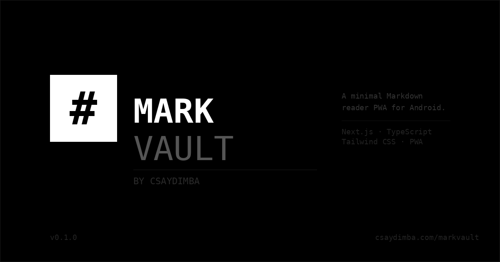

# MarkVault

> A minimal, fast Markdown reader PWA for Android — built by [Csaydimba](https://x.com/Csaydimba)



## Overview

MarkVault is a Progressive Web App (PWA) that lets you open, read, and browse `.md` files directly from your Android device. No sync. No cloud. Just your files, beautifully rendered.

Built with a strict **black & white** design system — sharp edges, monospace type, zero distractions. A serious tool for developers and writers.

---

## Tech Stack

| Layer | Tool |
|---|---|
| Framework | Next.js 14 (App Router) |
| Language | TypeScript |
| Styling | Tailwind CSS v3 |
| Markdown | `react-markdown` + `remark-gfm` + `rehype-highlight` |
| PWA | `next-pwa` |
| Storage | `localStorage` (recent files history) |
| Fonts | IBM Plex Mono + IBM Plex Sans (Google Fonts) |
| Deployment | Vercel |

---

## Features

- Open `.md`, `.mdx`, `.markdown` files from your phone storage
- Full GFM rendering — tables, checkboxes, code blocks, strikethrough
- Syntax highlighting in code blocks
- Recent files history (persisted in localStorage)
- Installable as a PWA — add to Android home screen
- Offline support via service worker
- Font size control (S / M / L)
- Pure dark mode — `#000000` black background

---

## Getting Started

### Prerequisites

- Node.js 20+
- npm or yarn

### Installation

```bash
git clone https://github.com/csaydimba/markvault.git
cd markvault
npm install
```

### Development

```bash
npm run dev
```

Open [http://localhost:3000](http://localhost:3000) on your browser or Android device (same network).

### Production Build

```bash
npm run build
npm start
```

### Deploy to Vercel

```bash
vercel deploy
```

---

## Project Structure

```
markvault/
├── public/
│   ├── manifest.json          # PWA manifest
│   ├── icons/                 # App icons (192x192, 512x512)
│   └── sw.js                  # Service worker (auto-generated)
├── src/
│   ├── app/
│   │   ├── layout.tsx         # Root layout + fonts
│   │   ├── page.tsx           # Home — file picker + recent files
│   │   ├── viewer/
│   │   │   └── page.tsx       # Markdown viewer screen
│   │   └── settings/
│   │       └── page.tsx       # Settings screen
│   ├── components/
│   │   ├── BottomNav.tsx      # Shared bottom navigation
│   │   ├── FileDropZone.tsx   # File picker + drag & drop
│   │   ├── MarkdownRenderer.tsx # Styled markdown output
│   │   ├── RecentFiles.tsx    # Recent files list
│   │   └── StatusBar.tsx      # Mobile status bar
│   ├── lib/
│   │   ├── fileUtils.ts       # File reading helpers
│   │   └── storage.ts         # localStorage recent files
│   └── types/
│       └── index.ts           # Shared TypeScript types
├── next.config.ts
├── tailwind.config.ts
└── README.md
```

---

## PWA Setup (Android)

1. Deploy to Vercel or serve over HTTPS
2. Open the URL in Chrome on Android
3. Tap the **"Add to Home Screen"** banner or use Chrome menu → Install app
4. MarkVault will appear on your home screen like a native app

---

## License

MIT © 2025 [Csaydimba]([https://csaydimba.com](https://x.com/Csaydimba))

---

## Author

Built by **Karamo** · Csaydimba  
[@devcamz](https://instagram.com/dev.camz) · [csaydimba.com](https://x.com/Csaydimba)
